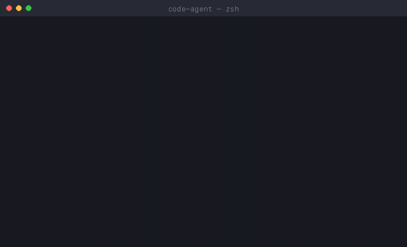

# Code Agent — 기억하는 터미널 코딩 에이전트

<p align="right">
  <a href="README.md">English</a> · <a href="README.zh-CN.md">简体中文</a> · <a href="README.ja.md">日本語</a> · <b>한국어</b>
</p>

<p align="center">
  <a href="https://github.com/sishenaichipingguo/code-agent/stargazers"></a>
  <a href="LICENSE"></a>
  <a href="https://bun.sh"></a>
  
</p>

**대부분의 코딩 에이전트는 닫는 순간 모든 것을 잊습니다. Code Agent는 다릅니다.** 세션을 넘나들며 지속적이고 검색 가능한 기억을 구축합니다. 당신의 선호, 프로젝트 규약, 과거의 결정이 에이전트에 남아 있어서 매번 다시 설명할 필요가 없습니다.

<!--
  이것은 scripts/make-demo-gif.py로 렌더링한 시뮬레이션 데모입니다.
  실제 화면 녹화가 준비되면 assets/demo.gif를 교체하세요.
-->
<p align="center">
  
</p>

```bash
# 설치 (macOS / Linux) — 사전 빌드된 바이너리 다운로드, Node/Bun 불필요
curl -fsSL https://raw.githubusercontent.com/sishenaichipingguo/code-agent/main/install.sh | bash

export ANTHROPIC_API_KEY=sk-...
agent "2칸 들여쓰기를 쓰고 named export를 선호한다고 기억해 줘"
```

## 왜 Code Agent인가?

다른 터미널 에이전트는 실행할 때마다 처음부터 시작합니다. 스택, 코딩 스타일, 프로젝트 규약을 매번 다시 설명해야 합니다. Code Agent는 기억을 일급 기능으로 다룹니다.

- 🧠 **세션 간 지속 기억** — 사실은 일반 Markdown으로 `.claude/memory/`에 저장되며 `user`, `project`, `feedback`, `reference` 네 가지 유형으로 정리됩니다. 사람이 읽을 수 있고, 버전 관리가 가능하며, 온전히 당신의 것입니다.
- ✨ **자동 추출** — 대화가 끝나면 LLM 패스가 보존할 가치가 있는 사실(“pnpm 사용”, “API는 `src/api`에 있음”, “default export 싫어함”)을 뽑아내므로 기억을 수동으로 관리할 필요가 없습니다.
- 🔎 **로컬 의미 검색** — 선택적 Worker 서비스가 로컬 `all-MiniLM-L6-v2` 모델(384차원, 데이터가 기기를 떠나지 않음)로 히스토리를 임베딩하고 SQLite + ChromaDB에 저장하여 과거 작업을 유사도 검색합니다.
- 👥 **팀 기억** — 정리된 기억 세트를 팀에서 공유하여 규약이 각자 다시 배우는 대신 모두에게 일관되도록 합니다.
- 🔒 **프라이버시 우선** — 임베딩은 로컬에서 실행되며 기억은 저장소 안의 파일일 뿐입니다. 당신이 설정한 모델 제공자 외에는 어디에도 전송되지 않습니다.

> 그 결과, 세 번째 세션쯤이면 에이전트는 이미 당신의 프로젝트가 어떻게 돌아가는지 알고 있습니다.

## 기대하는 모든 기능

- 🛠️ **내장 도구** — bash, read, write, edit, glob, grep, ls, cp, mv, rm
- 🤖 **멀티 모델** — Anthropic Claude 기본 지원, Ollama를 통한 로컬 모델
- 🔌 **MCP 지원** — Model Context Protocol 서버를 연결해 도구와 컨텍스트 확장
- 🎯 **YOLO 및 Safe 모드** — 속도를 위해 확인을 건너뛰거나, 위험한 작업에 승인 요구
- 🌊 **스트리밍 응답** — token과 비용을 실시간 추적
- 🎨 **인터랙티브 UI**(Ink) — 탭 자동완성과 키보드 단축키
- 📝 **세션 관리** — 지속적인 히스토리, `--continue`로 이어서 진행
- 🛑 **우아한 종료**, YAML 기반 설정

## 빠른 시작

### 설치 (권장)

설치 스크립트가 플랫폼에 맞는 독립 실행 바이너리를 가져옵니다. Node나 Bun이 필요 없습니다.

```bash
curl -fsSL https://raw.githubusercontent.com/sishenaichipingguo/code-agent/main/install.sh | bash
```

[Releases 페이지](https://github.com/sishenaichipingguo/code-agent/releases)에서 바이너리를 직접 다운로드할 수도 있습니다. Windows 사용자는 거기서 `.zip`을 받으세요. macOS 바이너리는 ad-hoc 서명이 되어 있습니다. Gatekeeper가 여전히 막으면 `xattr -d com.apple.quarantine $(which agent)`를 실행하세요.

그런 다음 키를 설정하면 됩니다.

```bash
export ANTHROPIC_API_KEY=your_key_here

agent "hello.txt 파일을 만들어 줘"             # 기본은 YOLO 모드
agent --mode safe "src/auth.ts를 리팩터링해 줘"  # 위험한 작업에 승인 요구
```

### 소스에서 빌드

[Bun](https://bun.sh)이 필요합니다.

```bash
git clone https://github.com/sishenaichipingguo/code-agent
cd code-agent
bun install
bun run dev "hello.txt 파일을 만들어 줘"

# 직접 독립 실행 바이너리 빌드
bun run build:binary
```

## 기억은 어떻게 동작하나

기억은 일반 파일로 프로젝트 안에 존재하므로 투명하고 검토 가능합니다.

```
.claude/memory/
├── MEMORY.md              # 사람이 읽는 인덱스, 유형별로 정리
├── user_indent-style.md   # "2칸 들여쓰기, named export 선호"
├── project_api-layout.md  # "REST 핸들러는 src/api, 라우트마다 파일 하나"
└── feedback_pr-style.md   # "PR 설명은 짧게, 이유부터 먼저"
```

각 항목은 간단한 frontmatter(`name`, `description`, `type`, `created`, `updated`)가 붙은 Markdown입니다. 네 가지 유형:

| 유형 | 기록 내용 |
|------|-----------|
| `user` | 당신의 개인 선호와 작업 스타일 |
| `project` | 이 코드베이스의 규약과 구조 |
| `feedback` | 당신이 에이전트에게 준 수정 사항 |
| `reference` | 남겨둘 가치가 있는 문서, 링크, 사실 |

### 자동 vs. 명시

- **명시**: 그냥 말하면 됩니다 — *"우리는 Docker Compose로 배포한다고 기억해"* — 기억 항목을 작성합니다.
- **자동**: `AutoExtractor`가 끝난 대화를 검토하고 새로운 장기 사실을 저장합니다. 인덱스에 이미 있는 것은 건너뜁니다.

### 선택: 의미 기억(Worker 서비스)

더 긴 히스토리에 대한 의미 검색이 필요하면 백그라운드 Worker를 실행하세요. 임베딩을 로컬에서 생성하고 SQLite + ChromaDB에 저장합니다.

```bash
# Worker 시작 (첫 실행 시 로컬 임베딩 모델을 다운로드)
export ANTHROPIC_API_KEY=your_key_here
bun run dev:worker

# 헬스 체크
curl http://localhost:37777/health
```

Worker는 **비침습적**입니다. 별도 프로세스로, CLI가 HTTP로 통신하며 완전히 선택 사항입니다. 전체 아키텍처와 데이터 흐름은 [README-MEMORY-SYSTEM.md](./README-MEMORY-SYSTEM.md)를 참고하세요.

## 설정

프로젝트에 `.agent.yml`을 생성하세요.

```yaml
provider: anthropic
model: claude-sonnet-4-6
mode: yolo

tools:
  bash:
    timeout: 30000
  rm:
    confirm: true

session:
  autoSave: true
  saveDir: .agent/sessions

logging:
  level: info
  file: .agent/logs/agent.log
```

### Ollama로 로컬 모델 사용

```yaml
provider: ollama
baseUrl: http://localhost:11434
model: qwen2.5-coder:7b
mode: yolo
```

```bash
ollama serve
ollama pull qwen2.5-coder:7b
```

> **참고:** Ollama 모델은 도구 호출을 지원하지 않으므로, 함께 사용할 때는 채팅 전용 모드로 동작합니다.

모든 설정 옵션은 `.agent.yml.example`을 참고하세요.

## 사용법

```bash
agent "요청 내용"                       # CLI 모드 (간단한 출력)
agent --ui "요청 내용"                  # 인터랙티브 UI (Ink)
agent --mode safe "요청 내용"           # 위험한 작업에 승인 요구
agent --model claude-opus-4 "..."      # 모델 지정
agent --continue "후속 메시지"          # 이전 세션 이어가기
```

### UI 모드

- 파일, 도구, 명령에 대한 **탭 자동완성**
- **키보드 단축키** — Ctrl+C로 종료, 화살표 키로 히스토리
- 응답의 **실시간 스트리밍**
- token 사용량과 성능을 보여주는 **상태 표시줄**

## 빌드

```bash
bun run build           # JavaScript 번들
bun run build:binary    # 네이티브 바이너리
```

## 아키텍처

- **CLI 계층** — 인자 파싱과 모드 판별
- **Agent 코어** — 도구 실행이 포함된 메인 루프
- **기억 시스템** — Markdown 저장소, 자동 추출, 팀 기억
- **Worker 서비스** — 선택적 의미 기억 (SQLite + ChromaDB + 로컬 임베딩)
- **도구 시스템** — 확장 가능한 도구 레지스트리
- **모델 어댑터** — 제공자를 가로지르는 통합 인터페이스
- **인프라** — 로깅, 메트릭, 트레이싱

## 라이선스

MIT
